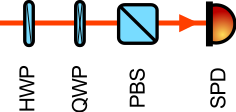
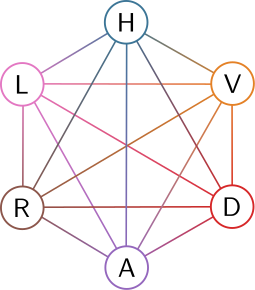
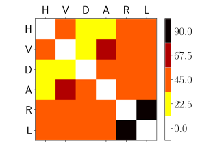

# Polarization-encoded qubit tomography basics
Tomography of a polarization-encoded qubit consists of polarization projection measurements. These are often the following:

* H: horizontal polarization
* V: vertical polarization
* D: diagonal polarization
* A: anti-diagonal polarization
* R: right-circular polarization
* L: left-circular polarization

The experimental scheme for the measurement of these projections can look like this:

This scheme consists of the following:

* HWP: a half-wave plate
* QWP: a quarter-wave plate
* PBS: a polarizing beamsplitter
* SPD: a single-photon detector

Different projections can be measured by adjusting the angles of the HWP and QWP according to this table:

| projection | HWP angle | QWP angle |
|------------|-----------|-----------|
|      H     |     0.0   |     0     |
|      V     |    22.5   |     0     |
|      D     |    45.0   |     0     |
|      A     |   -22.5   |     0     |
|      R     |     0.0   |    45     |
|      L     |     0.0   |   -45     |

The measurement duration can be shortened if the order of projection measurement is optimized, so that the least angle is traveled by the waveplates during all the necessary transition between projections. This is desirable especially for systems consisting of n qubits, as the number of measurements scales as 6^n.

# Travelling salesman problem (TSP) formulation of tomography

The one-qubit tomography can be represented using this graph:

The six nodes of the graph represent the six projection measurements. The edges (lines) between the nodes are weighted. The weight is the maximal angle (absolute-valued) traveled by any of the two waveplates during a transision between the two measurements.

The graph weights can be represented by the adjacency matrix, shown below:

The values of the matrix elements can be checked using the waveplate angle table above.
